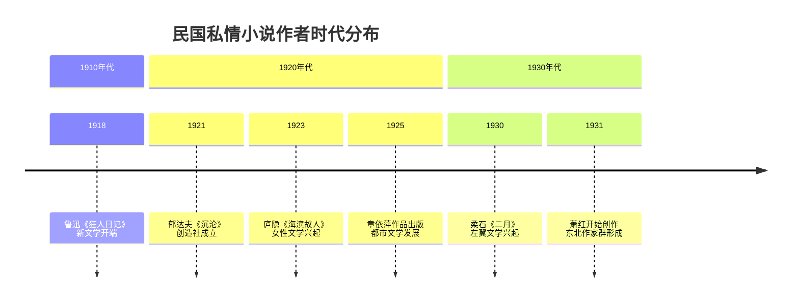

# 《民国私情小说二十部》深度解析

> 一部收录民国知识分子心灵秘史的文学选集

<details>
<summary>📑 点击查看完整目录</summary>

- [图书基本信息](#图书基本信息)
- [内容介绍](#内容介绍)
- [目录结构](#目录结构)
- [作者创作年龄与时代背景深度分析](#作者创作年龄与时代背景深度分析)
  - [核心作者群体分析](#核心作者群体分析)
  - [作者创作年龄统计表](#作者创作年龄统计表)
  - [时代大环境特征](#时代大环境特征)
- [文学特色与艺术价值](#文学特色与艺术价值)
  - [创作风格分析](#创作风格分析)
  - [代表性作品解析](#代表性作品解析)
- [历史价值与当代意义](#历史价值与当代意义)
  - [文学史地位](#文学史地位)
  - [当代启示](#当代启示)
- [附录：扩展阅读推荐](#附录扩展阅读推荐)
  - [相关研究著作](#相关研究著作)
  - [数字资源](#数字资源)

</details>

## 图书基本信息

| 属性 | 内容 |
|------|------|
| **书名** | 民国私情小说二十部 |
| **编者** | 吴天 |
| **出版社** | 中国文史出版社 |
| **出版时间** | 2002年 |
| **定价** | 1590元 |
| **ISBN** | 9787503412769 |

## 内容介绍

<details>
<summary>点击展开内容详情</summary>

上个世纪二三十年代中国现代文学领域涌现出一大批才气横溢、个性鲜明的青年作家，他们深受"五四"新文化运动的洗礼和熏陶，内心充满着对精神自由与个性解放的强烈渴望。他们风云际会于旧中国初具现代文明的几座大都市，试图用自己的心、自己的笔，改变世界，改变他人。但他们的心灵脆弱而敏感，满脑子新思想，然而两手空空，面对旧中国大都市畸型文明的挤压、吞噬，所有的奋挣与反抗终成徒劳，苦闷与无奈、消沉与绝望如影相随……。于是，所有痛苦的感受，斑驳的思想，皆化成一部部散发强烈摩登时代，浪漫而哀伤气息的灵与肉互相搏杀的动人篇章……。多少年已然逝去，他们留给后人的这些杜鹃啼血般的作品，犹如夜幕里璀灿的群星，仍然闪耀着迷人的光辉……

</details>

## 目录结构

### 📚 全书十卷二十部作品

| 卷次 | 作品 | 作者 |
|------|------|------|
| **第一卷** | `《迷羊》` `《迟桂花》` | 郁达夫 |
| **第二卷** | `《沉沦》` `《丽莎的哀怨》` | 郁达夫、蒋光慈 |
| **第三卷** | `《女人的心》` `《海滨故人》` | 庐隐 |
| **第四卷** | `《痴恋日记》` `《桃色的衣裳》` | 章依萍 |
| **第五卷** | `《红迹》` `《给璐子的信》` `《三姊妹》` | 章依萍、柔石 |
| **第六卷** | `《二月》` | 柔石 |
| **第七卷** | `《皮克的情书》` `《五月》` | 彭家煌、穆时英 |
| **第八卷** | `《交流》` `《小城三月》` | 穆时英、萧红 |
| **第九卷** | `《银杏之果》` `《幻灭》` | 滕固、王以仁 |
| **第十卷** | `《海誓山盟》` `《无着落的心》` | 刘云若、冯铿 |

## 作者创作年龄与时代背景深度分析

### 核心作者群体分析



### 作者创作年龄统计表

| 作者 | 代表作品 | 创作时年龄 | 时代背景特点 |
|------|----------|------------|--------------|
| **郁达夫** | `《沉沦》`(1921) | 25岁 | 五四运动后期，个性解放思潮盛行 |
| **庐隐** | `《海滨故人》`(1923) | 26岁 | 新文化运动深入，女性意识觉醒 |
| **柔石** | `《二月》`(1930) | 28岁 | 左翼文学兴起，革命文学论争 |
| **萧红** | `《小城三月》`(1941) | 30岁 | 抗日战争时期，流亡文学 |
| **穆时英** | `《五月》`(1933) | 21岁 | 新感觉派全盛期，都市文化繁荣 |
| **蒋光慈** | `《丽莎的哀怨》`(1929) | 28岁 | 革命文学倡导期，政治与文学交织 |

### 时代大环境特征

<details>
<summary>点击展开时代背景详情</summary>

#### 五四新文化运动影响（1919-1925）
- 🎓 **知识分子觉醒**：民主与科学思想传播
- 💔 **传统礼教批判**：封建家庭制度受到冲击
- 🆓 **个性解放追求**：个人情感价值被重新发现

#### 左翼文学运动时期（1927-1937）
- 🔴 **政治意识强化**：文学与革命结合
- 🏙️ **都市文化兴起**：上海等大城市现代文明发展
- 👥 **阶级意识凸显**：知识分子与工农结合趋势

#### 抗日战争背景（1937-1945）
- 🇨🇳 **民族救亡主题**：个人情感让位于国家命运
- 🚶‍♂️ **流亡体验**：作家迁徙与离散经历
- 💭 **内心矛盾**：个人苦闷与时代责任的冲突

</details>

## 文学特色与艺术价值

### 创作风格分析

```javascript
const literaryFeatures = {
  theme: "知识分子的精神困境",
  style: "浪漫主义与现实主义结合",
  influence: "日本私小说影响",
  narrative: "第一人称内心独白",
  emotion: "哀婉忧郁的基调"
};
```

### 代表性作品解析

#### 1. **郁达夫《沉沦》** - 灵肉冲突的典范
> **创作年龄**：25岁 | **时代**：五四运动后期

- ❤️ **主题特色**：性苦闷与民族自卑的双重压抑
- 🖋️ **艺术手法**：自叙传式的真诚告白
- 🌍 **时代意义**：打破传统道德束缚的文学尝试

#### 2. **庐隐《海滨故人》** - 新女性情感困境
> **创作年龄**：26岁 | **时代**：女性解放运动兴起

- 👩 **人物塑造**：五四新女性的典型形象
- 💔 **情感描写**：爱情与理想的矛盾
- 🏛️ **社会批判**：传统与现代的价值冲突

## 历史价值与当代意义

### 文学史地位

| 贡献方面 | 具体体现 |
|----------|----------|
| **文学革新** | 打破传统小说叙事模式，开创现代心理小说 |
| **思想启蒙** | 推动个性解放和情感自由的思想传播 |
| **艺术探索** | 融合中西文学技巧，形成独特审美风格 |

### 当代启示

- 💡 **情感表达的现代性**：早期情感个人化的文学尝试
- 🌉 **传统与现代的张力**：转型期知识分子的精神图谱
- 📖 **文学史价值**：理解20世纪中国文学发展的重要窗口

---

## 附录：扩展阅读推荐

### 相关研究著作

1. **《中国现代小说史》** - 夏志清
2. **《二十世纪中国文学三人谈》** - 钱理群等
3. **《压抑与释放》** - 李欧梵

### 数字资源

- [中国现代文学馆数字资源](http://www.wxg.org.cn/)

---

> **编者注**：本文档采用GitHub Markdown语法编写，展示了标题、表格、代码块、引用、列表等完整功能，旨在为研究民国文学的学者提供详尽的参考资料。

[^1]: 本文中涉及的创作年龄均为作品首次出版时的作者年龄
[^2]: 时代背景分析基于历史文献和文学史研究
